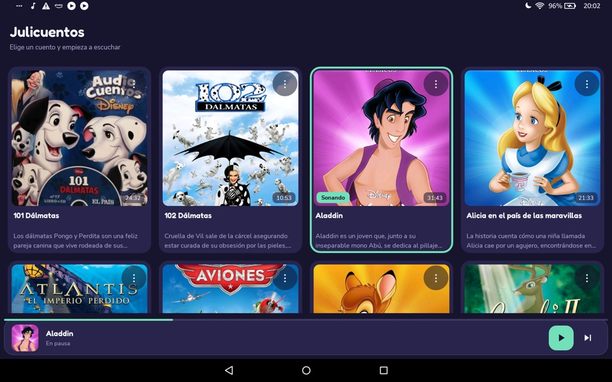
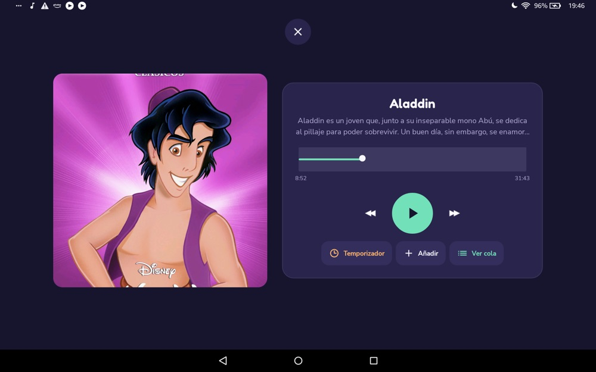
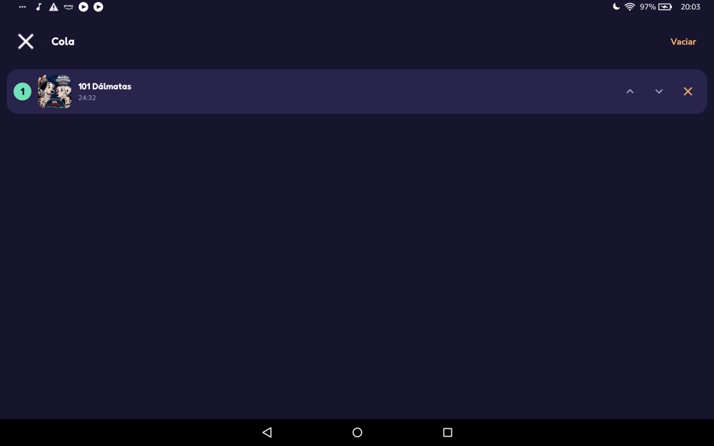
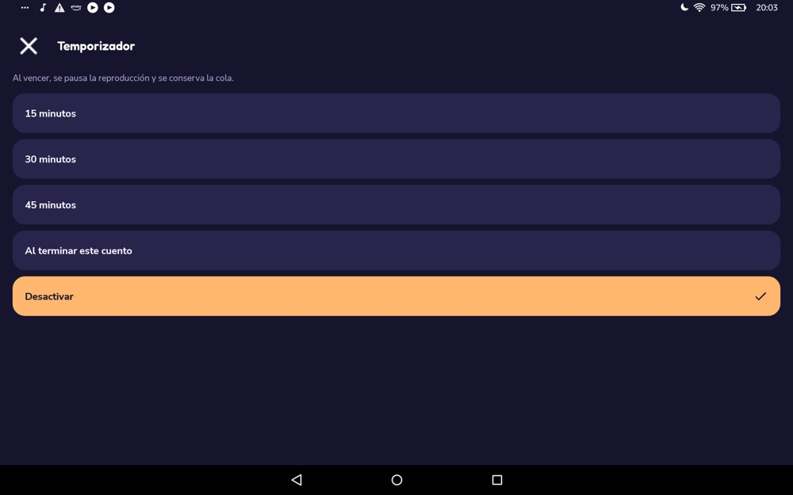

# Julicuentos

Reproductor de audiocuentos para niños, hecho para **tablets Android antiguas**.
Nativo, sin conexión, y pensado para que una tablet vieja —de esas que ya nadie usa—
vuelva a servir para lo único importante: poner un cuento antes de dormir.

Se llama **Julicuentos** por mi hija **Julia**. Lo escribí para una tablet Fire HD 10
de 2015, que andaba arrinconada en un cajón. Si tienes una tablet antigua olvidada y un
pequeño que no se quiere dormir, esto es para ti.

---

> ## ⚠️ Aviso importante sobre el contenido
>
> Este repositorio contiene **únicamente el código** de la aplicación.
> **No incluye audios ni imágenes de portada**, y nunca los incluirá.
>
> Los cuentos en formato audiolibro (Disney y de otras marcas) son **propiedad de sus
> respectivos autores y estudios**. Este proyecto **no distribuye, no aloja ni es
> responsable** de ese contenido. Cada usuario debe aportar **sus propios archivos**,
> de forma legal (por ejemplo, audiolibros que ya poseas o de dominio público).
>
> En el canal de Telegram **<https://t.me/AudiocuentosDisney>** circulan muchos de estos
> audios. **No es un canal nuestro, no estamos afiliados, y no nos hacemos responsables
> de su contenido.** Lo mencionamos solo a título informativo.

---

## Qué hace

- **Reproduce audios en segundo plano.** Se puede apagar la pantalla y sigue sonando.
  (Este era el fallo que tenía la app original y que arreglamos: un `MediaSessionService`
  real en primer plano, con controles en la notificación.)
- **Barra de progreso (seek) fiable.** Arrastras, sueltas, y salta exactamente ahí.
- **Cola de reproducción.** Añades varios cuentos y se reproducen en orden; puedes
  reordenar o quitar de la cola.
- **Temporizador de apagado (sleep timer).** 15 / 30 / 45 minutos o "al terminar este
  cuento". Baja el volumen poco a poco (~10 s) y se pausa — y sobrevive a la pantalla
  apagada.
- **Reanuda donde lo dejaste.** Al abrir la app vuelve al último cuento y posición.
- **Funciona 100 % sin conexión.** Los audios van _dentro_ de la APK. La app **no pide
  permiso de Internet**. Vuela en un avión, en el coche, sin wifi.

## Pantallas

Así se ve en la tablet. Las carátulas que aparecen son de una colección personal
(contenido de terceros); tú pones las tuyas siguiendo los pasos de más abajo.

| Catálogo | Reproductor |
|:--:|:--:|
|  |  |
| **Cola de reproducción** | **Temporizador de apagado** |
|  |  |

## Pensado para tablets antiguas

El objetivo era una **Amazon Fire HD 10 (2015)** con Android 5.1.1 (API 22) y hardware
limitado. Por eso:

- **Nativo (Kotlin + vistas XML).** Sin Jetpack Compose, sin Material Components, sin
  coroutines, sin inyección de dependencias, sin _desugaring_. Menos capas, más fluido
  en un chip de 2015.
- **Diseño plano** (flat): sin sombras, sin desenfoques, sin animaciones pesadas. La
  profundidad se consigue por color, no por efectos que la GPU antigua sufre.
- **`minSdk = 22`** → vale para cualquier dispositivo con Android 5.1 o superior.
- **Media3 fijado en 1.2.1**: las versiones 1.3.0+ exigen _desugaring_ y revientan en
  API 22. No lo subas sin revisar esto (ver `gradle/libs.versions.toml`).

## Requisitos para compilar

- **JDK 17**
- **Android SDK** con **platform android-34** y **build-tools 34.0.0**
- **Gradle 8.7** (el wrapper lo descarga solo la primera vez — necesitas Internet _para
  compilar_; la app resultante no lo necesita)

## Compilar e instalar

```bash
# 1. Señala dónde está tu Android SDK (o déjalo en local.properties: sdk.dir=/ruta/al/sdk)
export ANDROID_HOME="$HOME/Library/Android/sdk"   # ejemplo en macOS

# 2. Construye la APK de depuración
./gradlew assembleDebug

# 3. Instálala en la tablet conectada por adb
adb install -r app/build/outputs/apk/debug/app-debug.apk
```

> La APK **crece con los audios** que añadas (los MP3 van embebidos y sin comprimir).
> Con una colección grande puede pesar más de 1 GB: es normal.

## Cómo meter cuentos (lo importante)

Todo vive en `app/src/main/assets/`. **Nada de esto se sube a git**: lo aportas tú.

```
app/src/main/assets/
├── stories.json                 ← catálogo (lo creas tú a partir de stories.example.json)
├── audio/
│   └── mi-cuento.mp3            ← el audio, con el nombre = id
└── covers/
    └── mi-cuento/
        ├── cover.jpg            ← portada grande (reproductor)
        └── thumbnail.jpg        ← miniatura (rejilla del catálogo)
```

El **`id`** es la clave que lo ata todo: debe coincidir con el nombre del `.mp3` y con la
carpeta de la portada.

### Paso a paso

1. **Crea el catálogo.** Copia `stories.example.json` a `stories.json`:

   ```bash
   cp app/src/main/assets/stories.example.json app/src/main/assets/stories.json
   ```

2. **Añade el audio.** Coloca tu MP3 en `app/src/main/assets/audio/<id>.mp3`.

3. **Añade las portadas.** Crea `app/src/main/assets/covers/<id>/` con `cover.jpg` y
   `thumbnail.jpg`. **Cuadradas (1:1)** — el diseño las muestra así. Un buen tamaño:
   portada ~1000–1400 px, miniatura ~512 px.

4. **Registra el cuento** en `stories.json`. Cada entrada:

   ```json
   {
     "id": "mi-cuento",
     "titulo": "Mi cuento",
     "descripcion": "Sinopsis breve que se ve en la tarjeta y el reproductor.",
     "duracionSegundos": 1200,
     "cover": "covers/mi-cuento/cover.jpg",
     "thumbnail": "covers/mi-cuento/thumbnail.jpg"
   }
   ```

   Para obtener la duración exacta en segundos:

   ```bash
   ffprobe -v error -show_entries format=duration \
     -of csv=p=0 app/src/main/assets/audio/mi-cuento.mp3
   ```

5. **Recompila e instala** (`./gradlew assembleDebug && adb install -r ...`).

Puedes tener los cuentos que quieras; el catálogo se ordena alfabéticamente por `id`.

## Stack técnico

| Área     | Elección                              | Por qué                                        |
| -------- | ------------------------------------- | ---------------------------------------------- |
| Lenguaje | Kotlin 1.9                            |                                                |
| UI       | Vistas XML + AppCompat                | Ligero en hardware de 2015                     |
| Audio    | AndroidX **Media3 / ExoPlayer 1.2.1** | Reproducción en segundo plano + `MediaSession` |
| Imágenes | `BitmapFactory` + caché propia        | Sin librerías de carga de imágenes             |
| Pruebas  | JUnit 4                               | 61 tests de unidad                             |

## Estructura del proyecto

```
app/src/main/java/com/julicuentos/app/
├── audio/        Servicio de reproducción (MediaSessionService), cola, temporizador
├── ui/
│   ├── catalog/  Rejilla de cuentos + mini-reproductor
│   ├── player/   Pantalla de reproducción, barra de progreso, carátula
│   ├── queue/    Cola de reproducción
│   └── timer/    Temporizador de apagado
├── data/         Catálogo (stories.json) y persistencia de estado
└── common/       Utilidades (formato de tiempo, etc.)
```

## Licencia

El **código** de esta aplicación se publica bajo la licencia que se indica en el fichero
[`LICENSE`](LICENSE). El contenido audiovisual (audios y portadas) **no forma parte de
este proyecto ni de su licencia**: es responsabilidad de quien lo aporta.

## Descargo de responsabilidad

Este es un proyecto personal, sin ánimo de lucro, creado para uso doméstico. Se ofrece
**"tal cual"**, sin garantías de ningún tipo. No te hacemos responsable a ti ni reclamamos
derecho alguno sobre el contenido de terceros que decidas reproducir. Respeta los derechos
de autor: usa audiolibros que poseas legalmente o de dominio público.

---

_Hecho con cariño para Julia._
